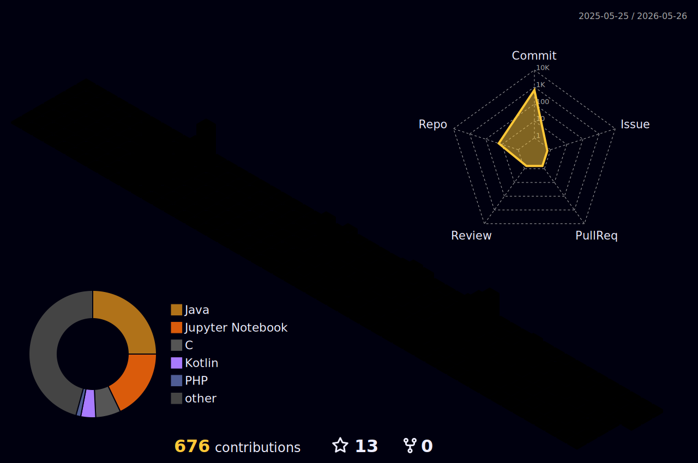

<h1 align="center">Hi there  I'm Luca</h1>


<h3 align="center">🇮🇹 Software Developer from Italy | Passionate about OpenSource, AI, Back-end and Games!</h3>

</br>

> ✨ *“Programming today is a race between software engineers striving to build bigger and better idiot-proof programs and the Universe trying to produce bigger and better idiots. So far, the Universe is winning.”*

</br>

<div align="center">
   <table align="center" cellpadding="0" cellspacing="4" border="0" style="margin-top:10px;">
    <tr>
      <td>
  
      </td>
    </tr>

  
  <table align="center" cellpadding="0" cellspacing="4" border="0" style="margin-top:10px;">
    <tr>
      <td></td>
      <td></td>
      <td></td>
      <td></td>
    </tr>
    <tr>
      <td></td>
      <td></td>
      <td></td>
      <td></td>
    </tr>
    <tr>
      <td></td>
      <td></td>
      <td></td>
      <td></td>
    </tr>
    <tr>
      <td></td>
      <td></td>
      <td></td>
      <td></td>
    </tr>
    <tr>
      <td></td>
      <td></td>
      <td></td>
      <td></td>
    </tr>
  </table>

  <br>
  
</div>

<p align="center">
  

</p>
⚡️ A little about me ⚡️<br/>
<p>
🧔 Hello, I'm <b>Luca</b>. I'm 20 years old and I'm a student of Computer Science and Engineering at the University of Bologna.<br/>
💼 I live in <a href="https://www.google.com/maps?q=cesena">Cesena</a>, Italy.<br/>
💻 Besides coding, my passions include playing video games, photographing natural landscapes, and traveling.<br/>
</p>

<!-- 🎶Now playing ...🎶<br/>
<a href="https://spotify-informer-l8rq.vercel.app/">

</a><br/>
<a href="https://github.com/MrStanDu33/spotify-informer"></a>-->
</br>
📊 Some statistics ... 📊<br/><br/>


<!--START_SECTION:waka-->

```txt
From: 13 August 2025 - To: 10 March 2026

Total Time: 79 hrs 3 mins

Java                74 hrs 43 mins        ███████████████████████▓░   94.02 %
Markdown            2 hrs 50 mins         █░░░░░░░░░░░░░░░░░░░░░░░░   03.57 %
JSON                49 mins               ▒░░░░░░░░░░░░░░░░░░░░░░░░   01.03 %
Other               24 mins               ░░░░░░░░░░░░░░░░░░░░░░░░░   00.52 %
Git Config          18 mins               ░░░░░░░░░░░░░░░░░░░░░░░░░   00.40 %
HTML                6 mins                ░░░░░░░░░░░░░░░░░░░░░░░░░   00.14 %
Kotlin              6 mins                ░░░░░░░░░░░░░░░░░░░░░░░░░   00.13 %
Gradle Kotlin DSL   5 mins                ░░░░░░░░░░░░░░░░░░░░░░░░░   00.12 %
Batchfile           1 min                 ░░░░░░░░░░░░░░░░░░░░░░░░░   00.03 %
Git                 0 secs                ░░░░░░░░░░░░░░░░░░░░░░░░░   00.01 %
YAML                0 secs                ░░░░░░░░░░░░░░░░░░░░░░░░░   00.00 %
Java Properties     0 secs                ░░░░░░░░░░░░░░░░░░░░░░░░░   00.00 %
XML                 0 secs                ░░░░░░░░░░░░░░░░░░░░░░░░░   00.00 %
CSS                 0 secs                ░░░░░░░░░░░░░░░░░░░░░░░░░   00.00 %
```

<!--END_SECTION:waka-->



</br>
<p>
📣 Need to get in touch? Find me here:<br/>
<a href="https://mail.google.com/mail/?view=cm&fs=1&to=turilloluca2005@gmail.com&su=[GitHub]%20🔥%20Contact&body=Hi%20Luca%2C%0A%0AI%20am%20contacting%20you%20today%20after%20seeing%20your%20GitHub%20profile%20to%20..."></a>
<a href="https://instagram.com/0icrel_0nidomoc/"></a>
<a href="https://www.linkedin.com/in/luca-turillo/"></a>
</p>
