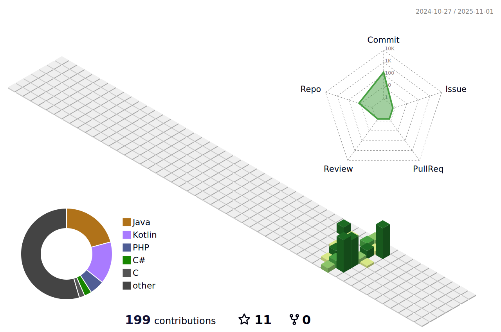

    
    
    

  
 

    
    
    
    
    
    
    
    
    
    
    
    
    
    
    
    
    
    

  📣 Need to get in touch? Find me here: 
  
  
  

---

### ⚡️ A little about me ⚡️ 

  🧔 Hello, I'm <bold>Luca</bold>. I'm 20 years old and I'm a student of Computer Science and Engineering at the University of Bologna. 
  💼 I live in <a href="https://www.google.com/maps?q=cesena">Cesena</a>, Italy. 
  💻 Besides coding, my passions include playing video games, photographing natural landscapes, and traveling. 

<!-- 🎶Now playing ...🶠
 
-->

  
Some statistics ...
 

<!--START_SECTION:github_stats-->

<!--END_SECTION:github_stats-->
